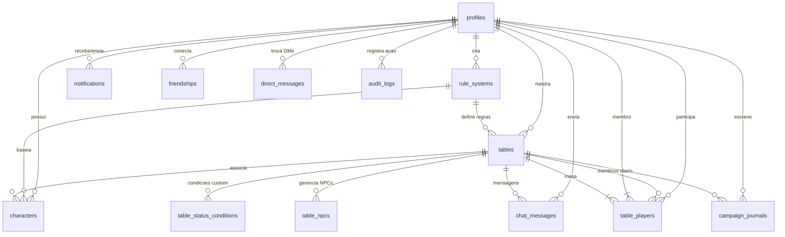

# 🗄️ Documentação Técnica do Banco de Dados — Galeria de Defensores

Este documento fornece a especificação completa do banco de dados relacional (PostgreSQL via Supabase) da aplicação **Galeria de Defensores**.

---

## 📐 Diagrama Entidade-Relacionamento (ER Diagram)

---

## 📋 Especificação Detalhada das Tabelas

### 1. `public.profiles`
Armazena as informações públicas do usuário vinculadas à conta do `auth.users`.
* **Colunas:**
  * `id` (`uuid`, PK, FK `auth.users.id` ON DELETE CASCADE)
  * `username` (`text`, UNIQUE, NOT NULL) — Nome de exibição único
  * `avatar_url` (`text`, NULL) — URL da imagem de perfil
  * `updated_at` (`timestamp with time zone`, DEFAULT `now()`)

### 2. `public.rule_systems`
Sistemas de Regras (Sandbox e Nativos como 3D&T Alpha e 3DeT Gaiden).
* **Colunas:**
  * `id` (`uuid`, PK, DEFAULT `uuid_generate_v4()`)
  * `user_id` (`uuid`, NULL, FK `profiles.id` ON DELETE CASCADE) — `NULL` para sistemas nativos globais
  * `name` (`text`, UNIQUE, NOT NULL)
  * `description` (`text`, NULL)
  * `attributes` (`jsonb`, NOT NULL) — Ex: `["F", "H", "R", "A", "PdF"]`
  * `resources` (`jsonb`, NOT NULL) — Configuração de PV, PM, PT com fórmulas
  * `advantages` (`jsonb`, DEFAULT `'[]'`, NOT NULL) — Catálogo de vantagens
  * `disadvantages` (`jsonb`, DEFAULT `'[]'`, NOT NULL) — Catálogo de desvantagens
  * `skills` (`jsonb`, DEFAULT `'[]'`, NOT NULL) — Catálogo de perícias
  * `damage_types` (`jsonb`, DEFAULT `'[]'`, NOT NULL) — Tipos de dano permitidos
  * `dice_config` (`jsonb`, DEFAULT `'{"count": 1, "faces": 6}'`, NOT NULL)
  * `is_base_system` (`boolean`, DEFAULT `false`, NOT NULL)
  * `created_at` (`timestamp with time zone`, DEFAULT `now()`)

### 3. `public.tables`
Mesas de RPG virtuais (VTT).
* **Colunas:**
  * `id` (`uuid`, PK, DEFAULT `uuid_generate_v4()`)
  * `name` (`text`, NOT NULL)
  * `description` (`text`, NULL)
  * `master_id` (`uuid`, FK `profiles.id` ON DELETE CASCADE, NOT NULL) — Mestre da mesa
  * `rule_system_id` (`uuid`, FK `rule_systems.id` ON DELETE SET NULL, NULL)
  * `is_private` (`boolean`, DEFAULT `false`, NOT NULL)
  * `password` (`text`, NULL)
  * `max_players` (`integer`, DEFAULT 4, CHECK `max_players >= 1 AND max_players <= 20`, NOT NULL) — Limite de jogadores (exclui o mestre)
  * `allow_spectators` (`boolean`, DEFAULT `true`, NOT NULL) — Permite entrada em modo espectador
  * `has_separated_chat` (`boolean`, DEFAULT `false`, NOT NULL) — Divisão de canais ON/OFF no chat
  * `rules_mod` (`jsonb`, DEFAULT `'{}'`, NOT NULL)
  * `custom_damage_types` (`text[]`, DEFAULT `'{}'`, NOT NULL)
  * `custom_unique_advantages` (`jsonb`, DEFAULT `'[]'`, NOT NULL)
  * `last_visual_roll` (`jsonb`, NULL) — Sincronização da rolagem 3D na mesa
  * `created_at` (`timestamp with time zone`, DEFAULT `now()`)

### 4. `public.table_players`
Membros conectados às mesas de RPG.
* **Colunas:**
  * `table_id` (`uuid`, FK `tables.id` ON DELETE CASCADE, PK)
  * `player_id` (`uuid`, FK `profiles.id` ON DELETE CASCADE, PK)
  * `role` (`text`, DEFAULT `'player'`, CHECK `role IN ('player', 'spectator')`, NOT NULL) — Cargo na mesa
  * `created_at` (`timestamp with time zone`, DEFAULT `now()`)

### 5. `public.characters`
Fichas de personagens de RPG.
* **Colunas:**
  * `id` (`uuid`, PK, DEFAULT `uuid_generate_v4()`)
  * `user_id` (`uuid`, FK `profiles.id` ON DELETE CASCADE, NOT NULL)
  * `rule_system_id` (`uuid`, FK `rule_systems.id` ON DELETE RESTRICT, NOT NULL)
  * `table_id` (`uuid`, FK `tables.id` ON DELETE SET NULL, NULL) — Vinculação à mesa
  * `name` (`text`, NOT NULL)
  * `concept` (`text`, NULL)
  * `scale` (`integer`, DEFAULT 0, NOT NULL) — Escala de poder (Ningen, Sugoi, Kiojin, Kami)
  * `points_total` (`integer`, DEFAULT 5, CHECK `points_total >= 0`, NOT NULL)
  * `experience` (`integer`, DEFAULT 0, CHECK `experience >= 0`, NOT NULL) — Saldo de PEs
  * `attributes_values` (`jsonb`, NOT NULL) — `{ "F": 1, "H": 2, "R": 1, "A": 1, "PdF": 0 }`
  * `resources_current` (`jsonb`, NOT NULL) — `{ "PV": 5, "PM": 5 }`
  * `advantages` (`jsonb`, DEFAULT `'[]'`, NOT NULL)
  * `disadvantages` (`jsonb`, DEFAULT `'[]'`, NOT NULL)
  * `skills` (`jsonb`, DEFAULT `'[]'`, NOT NULL)
  * `spells` (`jsonb`, DEFAULT `'[]'`, NOT NULL)
  * `items` (`jsonb`, DEFAULT `'[]'`, NOT NULL)
  * `status_effects` (`jsonb`, DEFAULT `'[]'`, NOT NULL) — Condições ativas
  * `created_at` (`timestamp with time zone`, DEFAULT `now()`)
  * `updated_at` (`timestamp with time zone`, DEFAULT `now()`)
* **Constraints:** Unique `(user_id, name)` — impede nomes duplicados para o mesmo usuário.

### 6. `public.chat_messages`
Mensagens do chat narrativo das mesas VTT.
* **Colunas:**
  * `id` (`uuid`, PK, DEFAULT `uuid_generate_v4()`)
  * `table_id` (`uuid`, FK `tables.id` ON DELETE CASCADE, NOT NULL)
  * `sender_id` (`uuid`, FK `profiles.id` ON DELETE SET NULL, NOT NULL)
  * `sender_name` (`text`, NOT NULL)
  * `content` (`text`, NOT NULL)
  * `type` (`text`, DEFAULT `'chat'`, CHECK `type IN ('chat', 'roll', 'system', 'action')`, NOT NULL)
  * `roll_result` (`jsonb`, NULL) — Dados estruturados de rolagem de dados
  * `channel` (`text`, DEFAULT `'ON'`, CHECK `channel IN ('ON', 'OFF')`, NOT NULL) — Canal narrativo
  * `created_at` (`timestamp with time zone`, DEFAULT `now()`)

### 7. `public.notifications`
Notificações e convites de mesa.
* **Colunas:**
  * `id` (`uuid`, PK, DEFAULT `uuid_generate_v4()`)
  * `user_id` (`uuid`, FK `profiles.id` ON DELETE CASCADE, NOT NULL) — Destinatário
  * `sender_id` (`uuid`, FK `profiles.id` ON DELETE CASCADE, NOT NULL) — Remetente
  * `table_id` (`uuid`, FK `tables.id` ON DELETE CASCADE, NULL)
  * `title` (`text`, NOT NULL)
  * `message` (`text`, NOT NULL)
  * `type` (`text`, DEFAULT `'INVITE'`, CHECK `type IN ('INVITE', 'SYSTEM', 'PE_DISTRIBUTION')`, NOT NULL)
  * `is_read` (`boolean`, DEFAULT `false`, NOT NULL)
  * `created_at` (`timestamp with time zone`, DEFAULT `now()`)

### 8. `public.campaign_journals`
Diário de campanha compartilhado e notas confidenciais.
* **Colunas:**
  * `id` (`uuid`, PK, DEFAULT `uuid_generate_v4()`)
  * `table_id` (`uuid`, FK `tables.id` ON DELETE CASCADE, NOT NULL)
  * `user_id` (`uuid`, FK `profiles.id` ON DELETE CASCADE, NOT NULL)
  * `title` (`text`, NOT NULL)
  * `content` (`text`, NOT NULL)
  * `is_public` (`boolean`, DEFAULT `false`, NOT NULL) — Publico (editado pelo Mestre) vs Privado (Nota Pessoal)
  * `updated_at` (`timestamp with time zone`, DEFAULT `now()`)

### 9. `public.table_status_conditions`
Condições e status customizados criados pelo Mestre da mesa.
* **Colunas:**
  * `id` (`uuid`, PK, DEFAULT `uuid_generate_v4()`)
  * `table_id` (`uuid`, FK `tables.id` ON DELETE CASCADE, NOT NULL)
  * `name` (`text`, NOT NULL)
  * `description` (`text`, NULL)
  * `color_class` (`text`, DEFAULT `'border-slate-800 bg-slate-900/20 text-slate-400'`, NOT NULL)
  * `icon` (`text`, DEFAULT `'Shield'`, NOT NULL)
  * `created_at` (`timestamp with time zone`, DEFAULT `now()`)

### 10. `public.friendships`
Conexões e solicitações de amizade entre usuários.
* **Colunas:**
  * `id` (`uuid`, PK, DEFAULT `uuid_generate_v4()`)
  * `user_id` (`uuid`, FK `profiles.id` ON DELETE CASCADE, NOT NULL) — Solicitante
  * `friend_id` (`uuid`, FK `profiles.id` ON DELETE CASCADE, NOT NULL) — Destinatário
  * `status` (`text`, DEFAULT `'pending'`, CHECK `status IN ('pending', 'accepted', 'declined')`, NOT NULL)
  * `created_at` (`timestamp with time zone`, DEFAULT `now()`)
* **Constraints:** Unique `(user_id, friend_id)`

### 11. `public.direct_messages`
Mensagens diretas privadas (DMs) entre amigos.
* **Colunas:**
  * `id` (`uuid`, PK, DEFAULT `uuid_generate_v4()`)
  * `sender_id` (`uuid`, FK `profiles.id` ON DELETE CASCADE, NOT NULL)
  * `receiver_id` (`uuid`, FK `profiles.id` ON DELETE CASCADE, NOT NULL)
  * `content` (`text`, NOT NULL)
  * `is_read` (`boolean`, DEFAULT `false`, NOT NULL)
  * `created_at` (`timestamp with time zone`, DEFAULT `now()`)

### 12. `public.table_npcs` *(Antecipado — Fase 11, Item 3)*
Quick NPC Tracker exclusivo do Mestre para controle rápido de ameaças e capangas.
* **Colunas:**
  * `id` (`uuid`, PK, DEFAULT `uuid_generate_v4()`)
  * `table_id` (`uuid`, FK `tables.id` ON DELETE CASCADE, NOT NULL)
  * `name` (`text`, NOT NULL)
  * `concept` (`text`, NULL)
  * `attributes_values` (`jsonb`, DEFAULT `'{"F":0,"H":0,"R":0,"A":0,"PdF":0}'`, NOT NULL)
  * `resources_current` (`jsonb`, DEFAULT `'{"PV":1,"PM":1}'`, NOT NULL)
  * `annotations` (`text`, NULL)
  * `created_at` (`timestamp with time zone`, DEFAULT `now()`)
  * `updated_at` (`timestamp with time zone`, DEFAULT `now()`)

### 13. `public.audit_logs` *(Antecipado — Fase 12, Item 5)*
Trilha de auditoria e segurança para registro de mutações críticas.
* **Colunas:**
  * `id` (`uuid`, PK, DEFAULT `uuid_generate_v4()`)
  * `user_id` (`uuid`, FK `profiles.id` ON DELETE SET NULL, NULL)
  * `action` (`text`, NOT NULL) — Ex: `CREATE_TABLE`, `DISTRIBUTE_XP`, `UPDATE_ROLE`
  * `entity_type` (`text`, NOT NULL) — Ex: `table`, `character`, `user`
  * `entity_id` (`text`, NULL)
  * `payload` (`jsonb`, DEFAULT `'{}'`, NOT NULL)
  * `created_at` (`timestamp with time zone`, DEFAULT `now()`)

---

## 🔒 Matriz de Políticas RLS (Row Level Security)

| Tabela | Operação | Permissão / Condição |
| :--- | :--- | :--- |
| `profiles` | SELECT | Público para todos os usuários autenticados |
| `profiles` | UPDATE | Somente o próprio dono (`auth.uid() = id`) |
| `rule_systems` | SELECT | Globais (`is_base_system = true`) OU criados pelo usuário (`auth.uid() = user_id`) |
| `rule_systems` | ALL | Somente o próprio autor (`auth.uid() = user_id`) |
| `tables` | SELECT | Mesas públicas (`is_private = false`), Mestre da mesa OU Membros ativos (`table_players`) |
| `tables` | ALL | Somente o Mestre da mesa (`auth.uid() = master_id`) |
| `table_players` | SELECT | Membros da mesma mesa OU Mestre |
| `table_players` | INSERT | Mestre, convidados com notificação de convite OU entradas em mesas públicas |
| `table_players` | DELETE | Mestre da mesa (Expulsar) OU o próprio jogador (Sair da mesa) |
| `characters` | SELECT | Próprio dono (`user_id = auth.uid()`) OR Mestre da mesa onde o personagem está vinculado |
| `characters` | UPDATE | Próprio dono OR Mestre da mesa vinculada |
| `chat_messages` | SELECT | Mestre, jogadores ou espectadores da mesa |
| `chat_messages` | INSERT | Apenas Mestre e Jogadores ativos (`role = 'player'`) — **Espectadores são bloqueados** |
| `direct_messages` | SELECT / INSERT | Envolvidos na conversa (`auth.uid() IN (sender_id, receiver_id)`) |
| `table_npcs` | ALL | **Exclusivo do Mestre** (`EXISTS (SELECT 1 FROM tables WHERE id = table_id AND master_id = auth.uid())`) |

---

## ⚡ Realtime Channels

A aplicação utiliza três modalidades de comunicação em tempo real via Supabase:

1. **Broadcast Channels (Lobby Chat):**
   * Canal: `lobby-global`
   * Mensagens voláteis em memória (sem gravar no banco de dados) com *slowmode* proporcional.

2. **Presence Channels (Status Online):**
   * Canal: `presence-table-${tableId}`
   * Rastreia lista de usuários ativos conectados à mesa VTT, exibindo tags `Mestre`, `Jogador` ou `Espectador`.

3. **Postgres Changes Replication:**
   * Tabelas na publicação `supabase_realtime`: `chat_messages`, `characters`, `campaign_journals`, `table_status_conditions`, `table_players`, `tables`, `direct_messages`.
